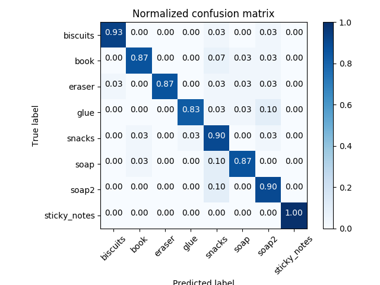
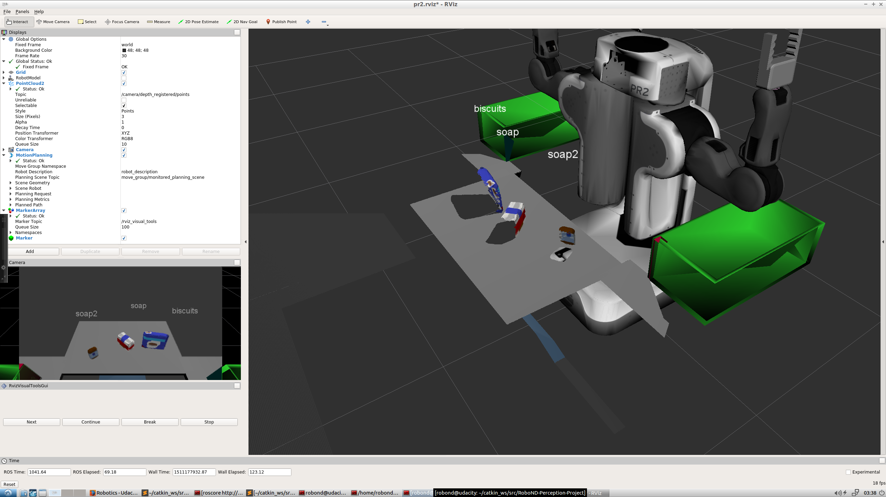
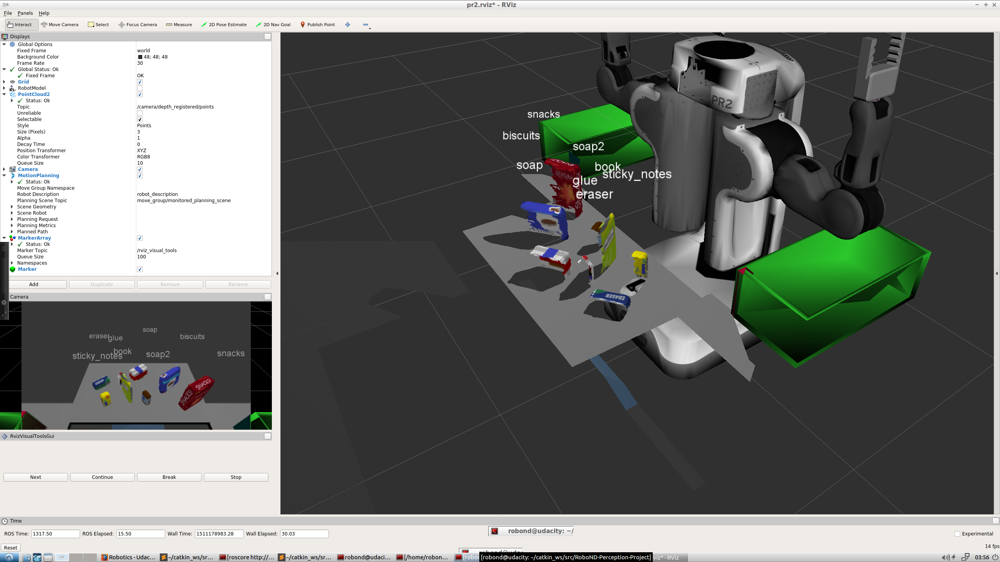

## Project: Perception Pick & Place
### Writeup Template: You can use this file as a template for your writeup if you want to submit it as a markdown file, but feel free to use some other method and submit a pdf if you prefer.

---


# Required Steps for a Passing Submission:
1. Extract features and train an SVM model on new objects (see `pick_list_*.yaml` in `/pr2_robot/config/` for the list of models you'll be trying to identify). 
2. Write a ROS node and subscribe to `/pr2/world/points` topic. This topic contains noisy point cloud data that you must work with.
3. Use filtering and RANSAC plane fitting to isolate the objects of interest from the rest of the scene.
4. Apply Euclidean clustering to create separate clusters for individual items.
5. Perform object recognition on these objects and assign them labels (markers in RViz).
6. Calculate the centroid (average in x, y and z) of the set of points belonging to that each object.
7. Create ROS messages containing the details of each object (name, pick_pose, etc.) and write these messages out to `.yaml` files, one for each of the 3 scenarios (`test1-3.world` in `/pr2_robot/worlds/`).  [See the example `output.yaml` for details on what the output should look like.](https://github.com/udacity/RoboND-Perception-Project/blob/master/pr2_robot/config/output.yaml)  
8. Submit a link to your GitHub repo for the project or the Python code for your perception pipeline and your output `.yaml` files (3 `.yaml` files, one for each test world).  You must have correctly identified 100% of objects from `pick_list_1.yaml` for `test1.world`, 80% of items from `pick_list_2.yaml` for `test2.world` and 75% of items from `pick_list_3.yaml` in `test3.world`.
9. Congratulations!  Your Done!

# Extra Challenges: Complete the Pick & Place
7. To create a collision map, publish a point cloud to the `/pr2/3d_map/points` topic and make sure you change the `point_cloud_topic` to `/pr2/3d_map/points` in `sensors.yaml` in the `/pr2_robot/config/` directory. This topic is read by Moveit!, which uses this point cloud input to generate a collision map, allowing the robot to plan its trajectory.  Keep in mind that later when you go to pick up an object, you must first remove it from this point cloud so it is removed from the collision map!
8. Rotate the robot to generate collision map of table sides. This can be accomplished by publishing joint angle value(in radians) to `/pr2/world_joint_controller/command`
9. Rotate the robot back to its original state.
10. Create a ROS Client for the “pick_place_routine” rosservice.  In the required steps above, you already created the messages you need to use this service. Checkout the [PickPlace.srv](https://github.com/udacity/RoboND-Perception-Project/tree/master/pr2_robot/srv) file to find out what arguments you must pass to this service.
11. If everything was done correctly, when you pass the appropriate messages to the `pick_place_routine` service, the selected arm will perform pick and place operation and display trajectory in the RViz window
12. Place all the objects from your pick list in their respective dropoff box and you have completed the challenge!
13. Looking for a bigger challenge?  Load up the `challenge.world` scenario and see if you can get your perception pipeline working there!

## [Rubric](https://review.udacity.com/#!/rubrics/1067/view) Points
### Here I will consider the rubric points individually and describe how I addressed each point in my implementation.  

---
### Writeup / README

#### 1. Provide a Writeup / README that includes all the rubric points and how you addressed each one.  You can submit your writeup as markdown or pdf.  

You're reading it!

### Exercise 1, 2 and 3 pipeline implemented
#### 1. Complete Exercise 1 steps. Pipeline for filtering and RANSAC plane fitting implemented.
The code is placed in file `project.py` (path: robond-3d-perception-p3/pr2_robot/scripts/) in method `pcl_callback()` from line 57 to 101. Following image shows a result of the objects separated from table and downsampled by voxel grid.


Following steps were performed:
- Statistical Outlier Filtering is used to reduce noise. Here i used the standard parameters.
- Voxel Downsamplig is used to reduce the resolution of the cloud so that there are less points to calculate. Hre eis used a leaf size of 0.01. This resulted in a good tradeoff of reducing noise and still having the points together.
- After that a PassThrough filter was applied so that we have a smaller regioj of interest. Fist i applied a Z-Axis filter only. This resulted in having the table and the objcts but also some parts of the left-hand and right-hand boxes. So i had to filter o the Y-Axis as well (see code lines 83ff).
- Finally i applied the RANSAC filter and identified the inliners and resulting outliers (code line 92ff)

#### 2. Complete Exercise 2 steps: Pipeline including clustering for segmentation implemented.  
The code is placed in file `project.py` (path: robond-3d-perception-p3/pr2_robot/scripts/) in method `pcl_callback()` from line 103 to 145. Following image shows a result of the clusters.


First i created a white cloud by extracting the position values. After that i applied Euclidiean Cluster Extraction (some neighboring algorithm like K-Neighbors) with forllowing parameters:
- TOLERANCE = 0.02
- MIN_CLUSTER_SIZE = 10
- MAX_CLUSTER_SIZE = 1000

This lead to good results clustering the objects and filtering the left noise completely out.
After that the clusters were colored and added to a new PointCloud (see code 134, 135)

Finally the table, objects and clusters were published as ROS messages.


#### 2. Complete Exercise 3 Steps.  Features extracted and SVM trained.  Object recognition implemented.
The code is placed in file `project.py` (path: robond-3d-perception-p3/pr2_robot/scripts/) in method `pcl_callback()` from line 148 to 184. I itertae through all detected clusters convert the data and calculate the histograms of HSV color space and normalized histogram.

Following code is used for calulating the histograms:
```
python
 import matplotlib.colors
import matplotlib.pyplot as plt
import numpy as np
from pcl_helper import *


def rgb_to_hsv(rgb_list):
    rgb_normalized = [1.0*rgb_list[0]/255, 1.0*rgb_list[1]/255, 1.0*rgb_list[2]/255]
    hsv_normalized = matplotlib.colors.rgb_to_hsv([[rgb_normalized]])[0][0]
    return hsv_normalized


def compute_color_histograms(cloud, using_hsv=False):

    # Compute histograms for the clusters
    point_colors_list = []

    # Step through each point in the point cloud
    for point in pc2.read_points(cloud, skip_nans=True):
        rgb_list = float_to_rgb(point[3])
        if using_hsv:
            point_colors_list.append(rgb_to_hsv(rgb_list) * 255)
        else:
            point_colors_list.append(rgb_list)

    # Populate lists with color values
    channel_1_vals = []
    channel_2_vals = []
    channel_3_vals = []

    for color in point_colors_list:
        channel_1_vals.append(color[0])
        channel_2_vals.append(color[1])
        channel_3_vals.append(color[2])
    
    # TODO: Compute histograms
    channel_1_hist = np.histogram(channel_1_vals, bins=32, range=(0, 256))
    channel_2_hist = np.histogram(channel_2_vals, bins=32, range=(0, 256))
    channel_3_hist = np.histogram(channel_3_vals, bins=32, range=(0, 256))

    # TODO: Concatenate and normalize the histograms
    hist_features = np.concatenate((channel_1_hist[0], channel_2_hist[0], channel_3_hist[0])).astype(np.float64)
    
    # Generate random features for demo mode.  
    # Replace normed_features with your feature vector
    normed_features = hist_features / np.sum(hist_features)
    return normed_features 


def compute_normal_histograms(normal_cloud):
    norm_x_vals = []
    norm_y_vals = []
    norm_z_vals = []

    for norm_component in pc2.read_points(normal_cloud,
                                          field_names = ('normal_x', 'normal_y', 'normal_z'),
                                          skip_nans=True):
        norm_x_vals.append(norm_component[0])
        norm_y_vals.append(norm_component[1])
        norm_z_vals.append(norm_component[2])

    # TODO: Compute histograms of normal values (just like with color)
    norm_x_hist = np.histogram(norm_x_vals, bins=32, range=(0, 256))
    norm_y_hist = np.histogram(norm_y_vals, bins=32, range=(0, 256))
    norm_z_hist = np.histogram(norm_z_vals, bins=32, range=(0, 256))

    # TODO: Concatenate and normalize the histograms
    hist_features = np.concatenate((norm_x_hist[0], norm_y_hist[0], norm_z_hist[0])).astype(np.float64)

    # Generate random features for demo mode.  
    # Replace normed_features with your feature vector
    normed_features = hist_features / np.sum(hist_features)

    return normed_features

```
Here i calcluate three channels (HSV or normalized depending on the function) concatenate the histograms to one feature vector and normalize those values of the feature vectors. After that i use a trained SVM Classifier on the given objects on the table (see code 165ff). The training data  was captured before the project run and saved in `model.sav` and training was performed and saved in `training_set.sav` according to the course lessons and based on the overall set of possible objects laying on the table in each scene.

Following images show the confusion matrix after training:



### Pick and Place Setup

#### 1. For all three tabletop setups (`test*.world`), perform object recognition, then read in respective pick list (`pick_list_*.yaml`). Next construct the messages that would comprise a valid `PickPlace` request output them to `.yaml` format.
The code is placed in file `project.py` (path: robond-3d-perception-p3/pr2_robot/scripts/) in method `pr2_mover()` from line 195 on.

This method gets the detected objects as parameter. based on these objects and according cloud data i calculate the centroids (see code 214). These centroids are used for pick pose calculation.

After that i loop through the related pick sequqnce file and check if have a match in my detected objects list. If the algorithm has identified the correct object (see code 233f) i assign the needed variables. Based on the given group of the pick up object i also identify the correct arm (green group equals right arm, red group equals left arm) This group determines in which box the robot should place the object. Based on the group the drop position is extracted from the dropbox parameter. 

Following images show the final labels on the identified objects:




The results are written in according `*.yml` files for submission. These files contain information for starting the pick and place process of the robot. But this pick and place actions are not part of this submission.

The object recognition could definetively be improved in future by tuning the SVM algorith with a different set of parameters. I tried out the `rbf` type of SVM but this failed as i have not adjusted the parameters. I have a training accuracy of ~90% but using the `rbf` predicted only books. Also the accuracy and predictions could be further improved by cearting more features meaning that the recording of each object could be extended including more images from different angles and positions. But this would take a while to record many more images from each object (factor 5).

Beside the object recognition the pick and place actions could also be improved. At the moment the robot would only get the positions of the centroids for picking up the objects and the according box placing positions. What is not regarding here is the collision detection. This means that the robot should be aware of all objects (even those that ar enot in sight at the beginning) so that he does not jnowck the over in movement. So he needs to track them and identify them as collidable. This could be done by rotating the robot to the left and right at the beginning of each run so that i discovers all unseen objects. 

There are many more possibilities to enhance the recognition and movement calculation which will be part of further lessons.


